# SyncMark 使用指南

## 一、安装谷歌插件

### 1.1 下载插件

[图片位置：插件下载页面截图]

### 1.2 安装步骤

1. 打开 Chrome 浏览器，进入扩展程序管理页面
   - 方式一：在地址栏输入 `chrome://extensions/`
   - 方式二：点击右上角菜单 → 更多工具 → 扩展程序

[图片位置：Chrome 扩展程序页面]

2. 开启"开发者模式"（右上角开关）

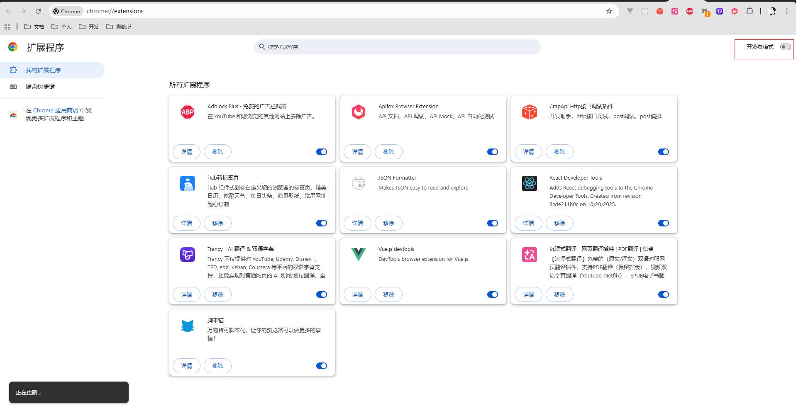

3. 点击"加载已解压的扩展程序"按钮

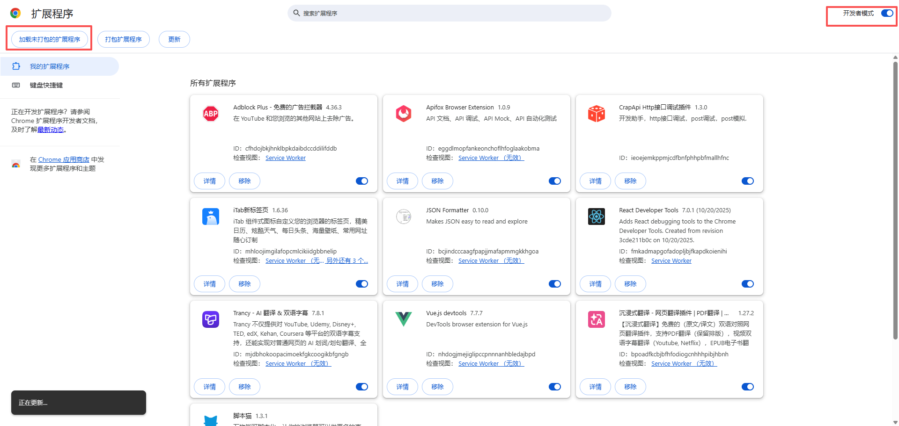

4. 选择 SyncMark 插件文件夹，点击"选择文件夹"

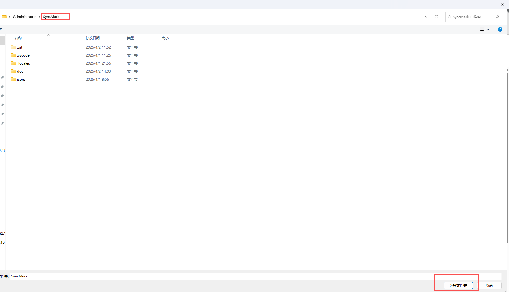

5. 安装成功后，插件图标会出现在浏览器工具栏

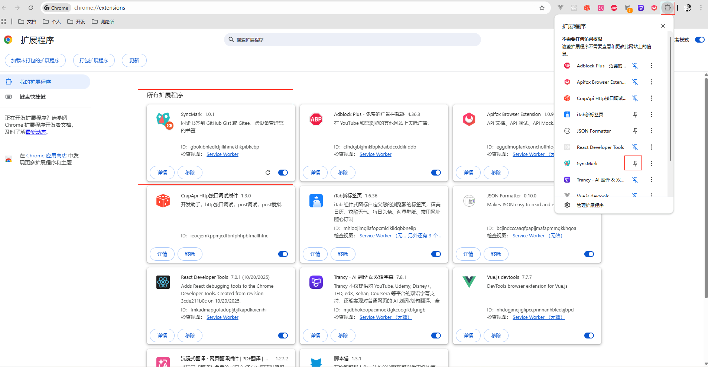
点击固定图标就会显示在通知栏杆什么可以长按拖动到第一个
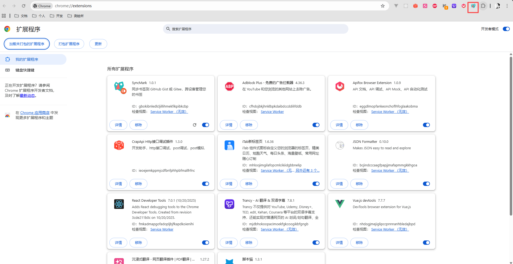
点击会出现到弹框插件
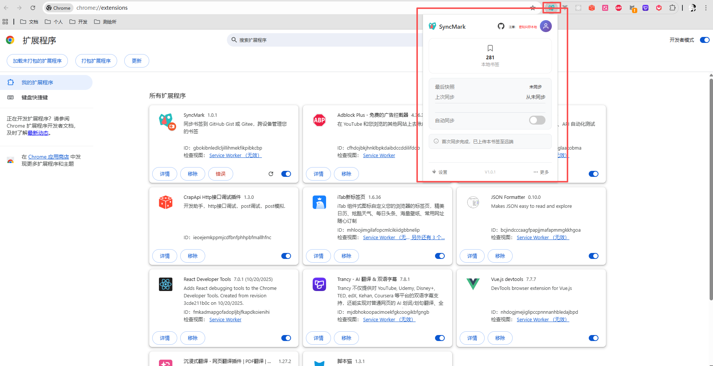

---

## 二、配置同步

### 2.1 选择同步平台

SyncMark 支持两个代码托管平台进行书签同步:

- **GitHub** - 全球最大的代码托管平台
- **Gitee (码云)** - 国内访问速度更快的代码托管平台

根据您的网络环境和使用习惯选择合适的平台。

5. **重要**: 复制生成的私人令牌
   - ⚠️ 令牌只会显示一次，请妥善保存
   - 建议保存到密码管理器中

1点击插件再点击头像按钮或者点击下面的设置按钮都会打开到设置配置token界面
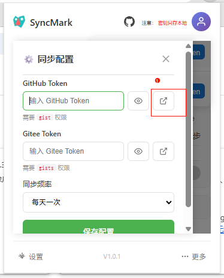

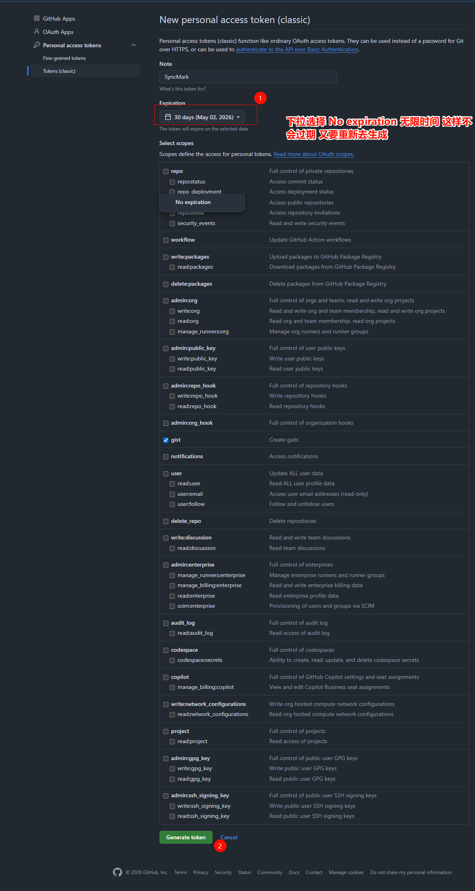
现在是GitHub token 点击这个圈红色位置会跳转到生成token界面 如果没注册和登录的话 请先注册登录 后再次点击就会出现下图界面 点击生成就行

出来token 复制粘贴到输入框点击保存设置就好了
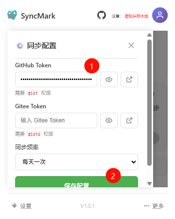
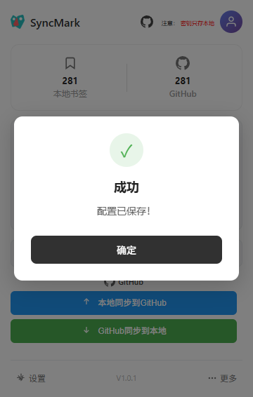
第一次会出现红色角标
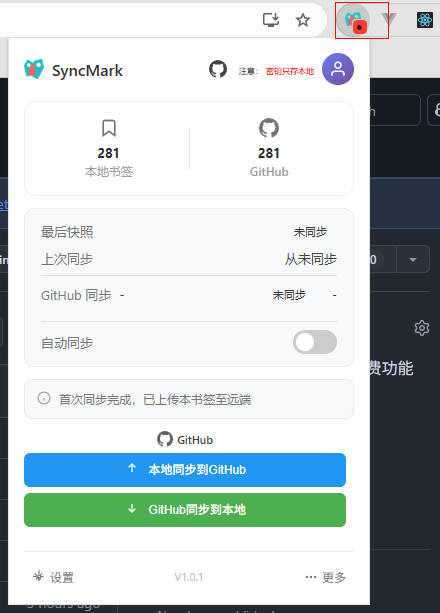
点击同步上传到你配置平台就会消失红色呢角标
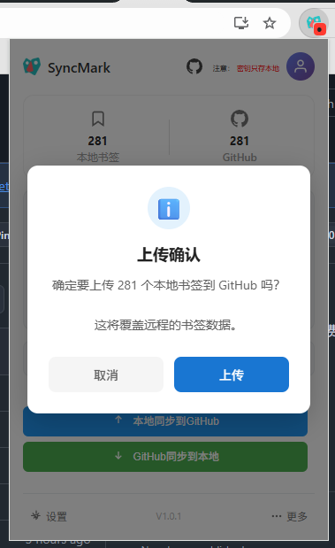
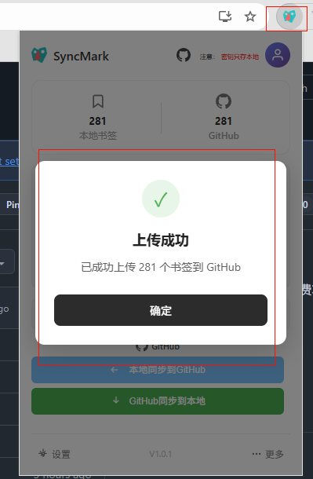
新收藏书签也会提示红色角标
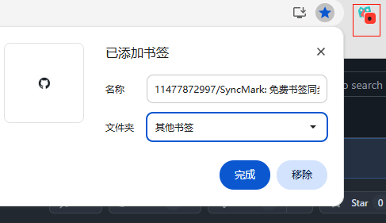
移除也会消失 只要本地和远程不一样就会提示红色角标

点击远程同步到本地就会全部覆盖远程最新的数据到本地
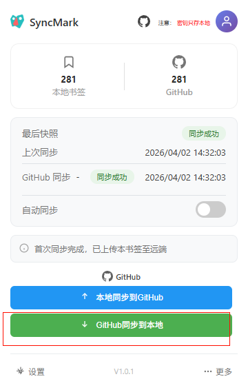

现在是Gitee token 点击这个圈红色位置会跳转到生成token界面 如果没注册和登录的话 请先注册登录 后再次点击就会出现下图界面 点击生成就行
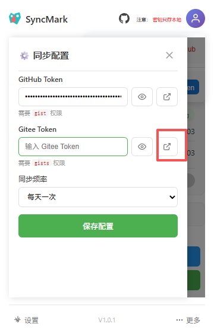
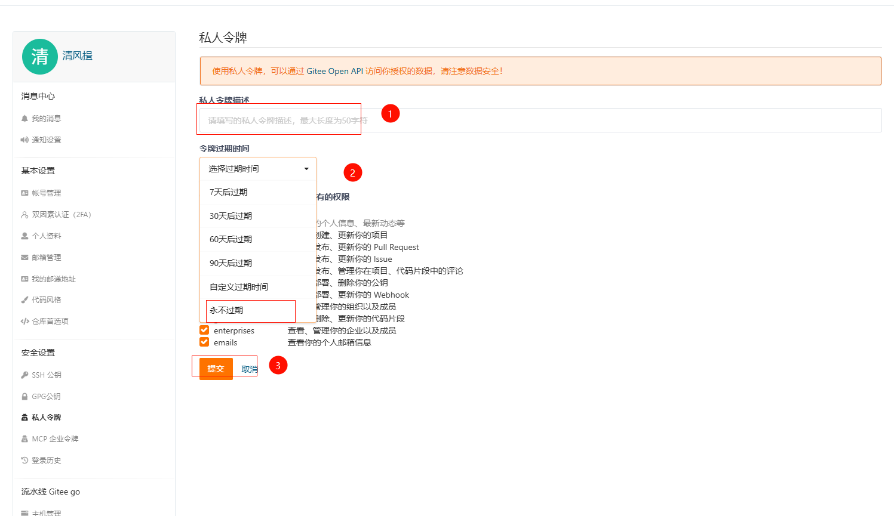

出来token 复制粘贴到输入框点击保存设置就好了
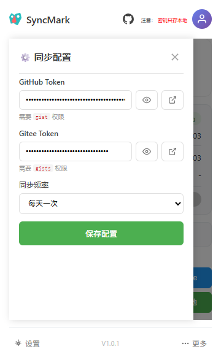
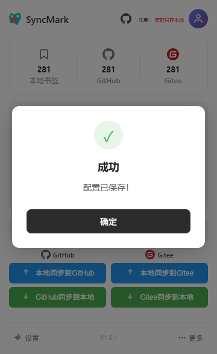

剩下跟上面GitHub教程类似 

注意如果token填错了了会校验 提示错误 删除输入框token只就可以保存配置如图
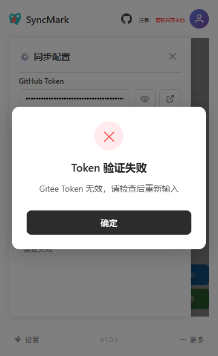